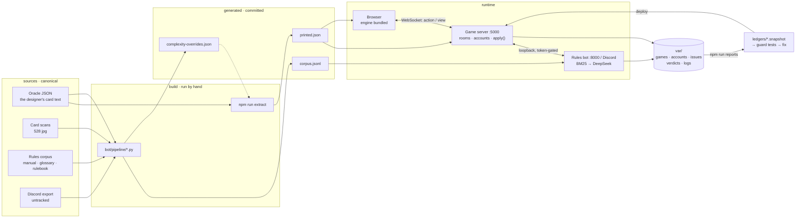

# Algomancy

Tools for [Algomancy](https://algomancy.io/), Caleb Gannon's card game: a rules
bot that answers questions about it, and an online client that enforces the
rules while you play. The client is live at **<https://algomancy.online>**.

It is a fan project, made with Caleb's permission, free, with no economy. Buy
[the physical game](https://shop.calebgannon.com/products/algomancy-the-base-game)
or at least [the print-and-play](https://shop.calebgannon.com/products/algomancy-print-and-play-edition)
before you play here.

Three things live here, and they are peers.

| | what it is | size |
|---|---|---|
| **[`data/`](data/README.md)** | the shared source data: 528 card scans, the oracle JSON, the rules corpus, the icons, the designer's rulings. No code. Both halves read it. | ~85 MB |
| **[`bot/`](bot/README.md)** | the **rules bot**: retrieval over the rules corpus, answering in Discord and in a browser, plus card search, grafted-card composition and draft practice | ~10k lines of Python |
| **[`client/`](client/README.md)** | the **digital client**: a rules-enforcing Algomancy you play online. A pure engine, 492 scripted cards, a WebSocket server, accounts, decks, matchmaking, a tutorial | ~245k lines of TypeScript |

The repo began as the bot in June 2026 and grew the client inside it that
July. They share `data/` and, on a deployed box, a little loopback HTTP.
Neither imports the other.

## How it was built

Every line of code here was written by AI coding agents, directed by one
person. The division of labour is deliberate, and it is the reason the code
looks the way it does:

> The agent writes the code and makes the low-level decisions. It chooses the
> pipes, welds them together and tests they are waterproof. I decide where the
> pipes go and what the overall purpose is, oversee the installation, and help
> where agents are still weak.

Three consequences for anyone reading it:

- **The reasons are at the point of use.** A non-obvious decision carries a
  comment saying why, usually with the date and the playtest that forced it.
  Those comments are the design record; there is no separate one. Read them
  before changing what they guard.
- **Every ruling is a test.** The paper rules leave gaps an engine has to
  fill. Each adjudication is a numbered ruling in
  [`client/docs/digital-rules.md`](client/docs/digital-rules.md), R1–R300
  and counting, and a test that encodes it. That file is the engine's spec.
- **The work queues are in the repo.** [`client/ledgers/`](client/ledgers/README.md)
  holds every ticket, bug report and verdict, open and closed. The closed
  halves are long and are kept on purpose: each closed entry names the test
  that proves it, and those tests still run. They are the project's memory.

## The map



Left to right: sources a person made, scripts run by hand, the files they
produce, the programs that read them. The loop at the bottom is how a
playtest becomes a ruling becomes a test. A few rules hold everywhere:

- **Canonical or generated, never both.** A file is hand-made and never
  regenerated, or generated and never hand-edited. A wrong value in a
  canonical file is fixed in that file, with the reason in the commit; a
  generated file is never patched.
- **Paths are named once.** Three modules, one per runtime context, name every
  location: `bot/paths.py`, `client/engine/scripts/paths.mjs` and
  `client/ui/assets.ts`. Nothing else spells a path.
- **Printed data is pulled, behaviour is written.** A card's cost, stats and
  type are extracted from the oracle text. Only its rules are hand-authored.
- **Seed plus actions is the game.** The engine is a pure reducer with the
  RNG inside the state, so a saved log replays exactly and any bug report can
  be reproduced.
- **Queries derive, nothing is cached.** Whether a unit is Flying right now is
  computed from statics, mods and its column at the moment of asking.
- **Runtime state is the only mutable thing.** It lives in one gitignored
  directory, `var/`, is redirectable for tests, and comes back into the repo
  only as a committed snapshot the suite checks.
- **Absent, not broken.** Every cross-program integration is gated on a
  token. Unset, the feature does not exist, and nothing errors.

There is no database. Every stored thing is a JSON or JSONL file under `var/`
with a named owner, rewritten whole or appended to, and backed up nightly.

## Run it

**The client**, from a fresh clone:

```bash
npm --prefix client/engine install      # ui, server and ledgers borrow engine's node_modules
npm --prefix client/server install      # one dependency: ws
npm --prefix client run dev             # builds the UI bundle, serves http://localhost:5177
```

`dev` binds loopback, keeps every saved game and account under `var/dev/`, and
runs without the Discord integration. With no server at all, open
`client/ui/index.html` straight off disk after `npm --prefix client/ui run build`:
a hotseat game with the same engine, `?demo` for a scripted mid-battle.

**The bot** needs a DeepSeek key, and a Discord token for the Discord half:

```bash
cp .env.example .env                    # fill in DISCORD_TOKEN and DEEPSEEK_API_KEY
python3 -m venv .venv && .venv/bin/pip install -r bot/requirements.txt
.venv/bin/python bot/app.py             # the web app, http://127.0.0.1:8000
.venv/bin/python bot/bot.py             # the Discord bot
```

Deployed, all three are systemd units behind Caddy: [`deploy/`](deploy/README.md)
is the recipe from a blank Ubuntu image up.

## The gates

```bash
npm --prefix client run check           # typecheck + every suite + the UI bundle + the bot's tests
.venv/bin/python bot/test/run_all.py    # just the bot's eight test scripts
```

`check` fans out to engine, ui, server and ledgers, then the bot. It takes
about five minutes and the server suite binds a port, so run it in the
background and never two at once. There is no CI; deploy is a git pull and a
restart, and the gate is what stands in for it.

## Layout

```
data/            cards/ · icons/ · rules/ · corpus/ · rulings/     the shared data, and NOTICE.md
bot/             the runtime modules · app.py (web) · bot.py (Discord) · cogs/ · web/ · test/
bot/pipeline/    the scripts that BUILD data/ — run by hand, never on a request path
client/engine/   src/ (the rules reducer) · test/ · scripts/         the engine, and only the engine
client/ui/       the browser client, one esbuild bundle; imports the engine
client/server/   the WebSocket game server · test/ (unit) · e2e/ (spawns the real server)
client/ledgers/  every work queue, open and closed, and the snapshots of live reports
client/docs/     the specs: digital-rules.md (the ruling register), deck-format.md, the design docs
deploy/          Caddyfile, the systemd units, the backup, the install recipe
var/             ALL mutable runtime state. Gitignored whole. Never commit it; back it up.
```

## Contributing

- **Read [`CLAUDE.md`](CLAUDE.md) first.** It is the working guide for the
  agents and it is short: what is generated and must not be hand-edited, which
  directories are secretly test fixtures, and the operational rules that have
  cost real time. Everything in it applies to a person too.
- Work on a branch or a worktree, get `npm --prefix client run check` green,
  then land. Other sessions may be editing the tree at the same time.
- A change to a card's printed data goes in the oracle JSON with the reason in
  the commit, then `npm --prefix client/engine run extract`. A change to a
  card's behaviour goes in its set file, and its test is the definition of
  done.
- A rule the engine has to decide gets a ruling in `digital-rules.md` and a
  test. A bug from a playtest gets a ledger entry that names the test that
  would catch it again.
- `client/engine/src/cards/sets/index.ts` is append-only. Import order is
  deck order, and every saved game depends on it.

## Licence and attribution

The code is MIT, see [`LICENSE`](LICENSE). The card art, card text, rulebooks
and rulings under `data/` are Caleb Gannon's, used with his permission and not
under that licence: [`data/NOTICE.md`](data/NOTICE.md) says what that means if
you fork this. The code was written by Claude (Anthropic's AI model); the
project was developed and directed by Ben Adams.

## Links

- Official site: <https://algomancy.io/> · Community: [Algomancy Discord](https://discord.gg/EQyyjdf4Dr)
- Card data: <https://calebgannon.com/algomancycards/> · Glossary: <https://calebgannon.com/2022/09/06/algomancy-rules-glossary/>
- Rulebook PDF: <https://calebgannon.com/wp-content/uploads/Algomancy-manual-copy.pdf>
- Deck builder: <https://algomancer.cc/>, whose deck links the client imports
